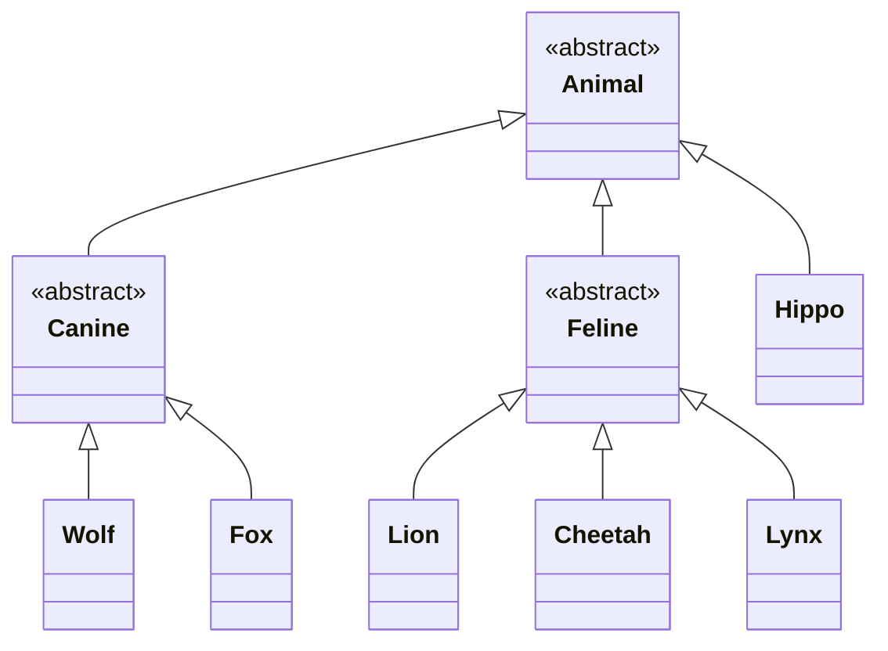

# Classes abstratas e interfaces

## Algumas classes não devem ser instanciadas

Faz sentido criarmos novos objetos do tipo **Wolf**, **Hippo** e **Fox**, mas a hierarquia de herança também permite
que criemos objetos genéricos de **Animal**. Isso é um problema, porque não conseguimos dizer exatamente como um animal
se comporta: como ele é, o que ele come, que tipo de som ele faz, e assim por diante.

Precisamos da classe ´Animal´ para **herança** e **polimorfismo**, mas queremos permitir a criação de instâncias apenas 
das subclasses menos abstratas de ´Animal´, e não da própria classe ´Animal´. Ou seja, queremos poder criar objetos 
Hippo, Wolf e Fox, mas não objetos Animal.

---

## Declare uma classe como abstract para impedir sua instanciação

Se você quiser impedir que uma classe seja instanciada, pode marcá-la como **abstrata** utilizando a palavra-chave **abstract**.
Ser uma classe abstrata significa que ninguém pode criar objetos desse tipo, mesmo que você tenha definido um construtor
para ela. Você ainda pode usar essa classe abstrata como tipo de variável declarada, mas não precisa se preocupar com 
alguém criando objetos diretamente desse tipo - o compilador impede isso automaticamente.

```
abstract class Animal {
    ...   
}

var Animal: Animal
animal = Wolf()
animal = Animal() // This line won't compile
```

---

## Abstrata ou concreta?

Na nossa hierarquia de classes `Animal`, existem três classes que precisam ser declaradas como **abstratas**: `Animal`, 
`Canine` e `Feline`. Embora precisemos dessas classes para **herança**, não queremos que ninguém possa criar objetos 
diretamente a partir delas. Uma classe que não é abstrata é chamada de **concreta**. Isso significa que as seguintes 
classes permanecem como subclasses concretas:

- `Hippo`
- `Wolf`
- `Fox`
- `Lion`
- `Cheetah`
- `Lynx`

De forma geral, decidir se uma classe deve ser **abstrata** ou **concreta** depende do **contexto da aplicação**. Por 
exemplo, uma classe `Tree` pode precisar ser abstrata em um sistema de um viveiro de árvores, onde as diferenças entre 
um `Oak` (carvalho) e um `Maple` (bordo) realmente importam. Por outro lado, se você estivesse desenvolvendo 
uma simulação de golfe, `Tree` poderia ser uma classe concreta, já que a aplicação não precisa diferenciar tipos 
específicos de árvores.



---

## Propriedades e funções abstratas

Em uma **classe abstrata**, você pode optar por marcar **propriedades e funções como abstratas**. Isso é útil quando a 
classe possui comportamentos que **não fazem sentido sem uma implementação específica**, e você não consegue pensar 
em uma implementação genérica que seria útil para as subclasses herdarem.

- Uma classe abstrata pode conter **tanto propriedades e funções abstratas quanto não abstratas**.
- Inclusive, é possível que uma classe abstrata **não tenha nenhum membro abstrato**.

---

## Uma interface permite definir comportamento comum FORA da hierarquia de superclasses

'Interfaces' são usadas para definir um **protocolo de comportamento comum**, permitindo que você aproveite o 
**polimorfismo** sem depender de uma estrutura rígida de herança. Interfaces são semelhantes a **classes abstratas**, pois:

- Não podem ser instanciadas
- Podem definir propriedades e funções **abstratas ou concretas**

Mas existe uma diferença fundamental:

> Uma classe pode **implementar várias interfaces**, mas só pode **herdar de uma única superclasse direta**.

Isso significa que o uso de interfaces pode oferecer os mesmos benefícios das classes abstratas, porém com **muito mais 
flexibilidade**. Vamos ver como isso funciona adicionando uma interface chamada `Roamable` à nossa aplicação. Usaremos 
essa interface para definir o comportamento de **“andar por aí” (roaming)**, e faremos com que tanto `Animal` quanto 
`Vehicle` a implementem. Vamos começar definindo a interface `Roamable`:

```kotlin
interface Roamable {
    fun roam()
}
```

## Funções em interfaces podem ser abstratas ou concretas

Você adiciona funções a uma interface incluindo-as dentro do seu corpo (entre chaves `{}`). No nosso exemplo, estamos 
definindo uma função **abstrata** chamada `roam`, então o código fica assim:

```kotlin
interface Roamable {
    fun roam() // É assim que se define uma função abstrata em uma interface
}
```

Quando você adiciona uma função abstrata a uma interface, **não é necessário usar a palavra-chave abstract**, como faria
em uma classe abstrata. Isso acontece porque, em interfaces, o compilador infere automaticamente que uma função sem corpo
é abstrata. Ou seja, não é preciso marcar explicitamente. 

Você também pode adicionar **funções concretas (com implementação)** em interfaces, fornecendo um corpo para a função. O
código a seguir, por exemplo, define uma implementação concreta para `roam`:

```kotlin
interface Roamable {
    fun roam() {
        println("The object is roaming") // Para adicionar uma função concreta em uma interface,
        // simplesmente dê a ela um corpo!
    }   
}
```

## Como definir propriedades em interfaces

Você adiciona uma propriedade a uma interface incluindo-a dentro do corpo da interface. Essa é **a única forma de definir 
propriedades em interfaces**, já que, diferentemente de classes abstratas, interfaces **não possuem construtores**.
Veja, por exemplo, como adicionar uma propriedade abstrata do tipo `Int` chamada `velocity` à interface `Roamable`:

```kotlin
interface Roamable {
    val velocity: Int
}
```

## Declarando que uma classe implementa uma interface

Você indica que uma classe implementa uma interface de forma semelhante a quando declara herança de uma superclasse: 
adicionando **dois pontos (`:`)** no cabeçalho da classe, seguidos do nome da interface. Veja, por exemplo, como declarar
que a classe `Vehicle` implementa a interface `Roamable`:

```kotlin
class Vehicle : Roamable {
    // implementação aqui
}
```

Diferentemente da herança de uma superclasse, **você não coloca parênteses após o nome da interface**. Isso acontece 
porque os parênteses são usados apenas para chamar o construtor da superclasse, **e interfaces não possuem construtores**.

